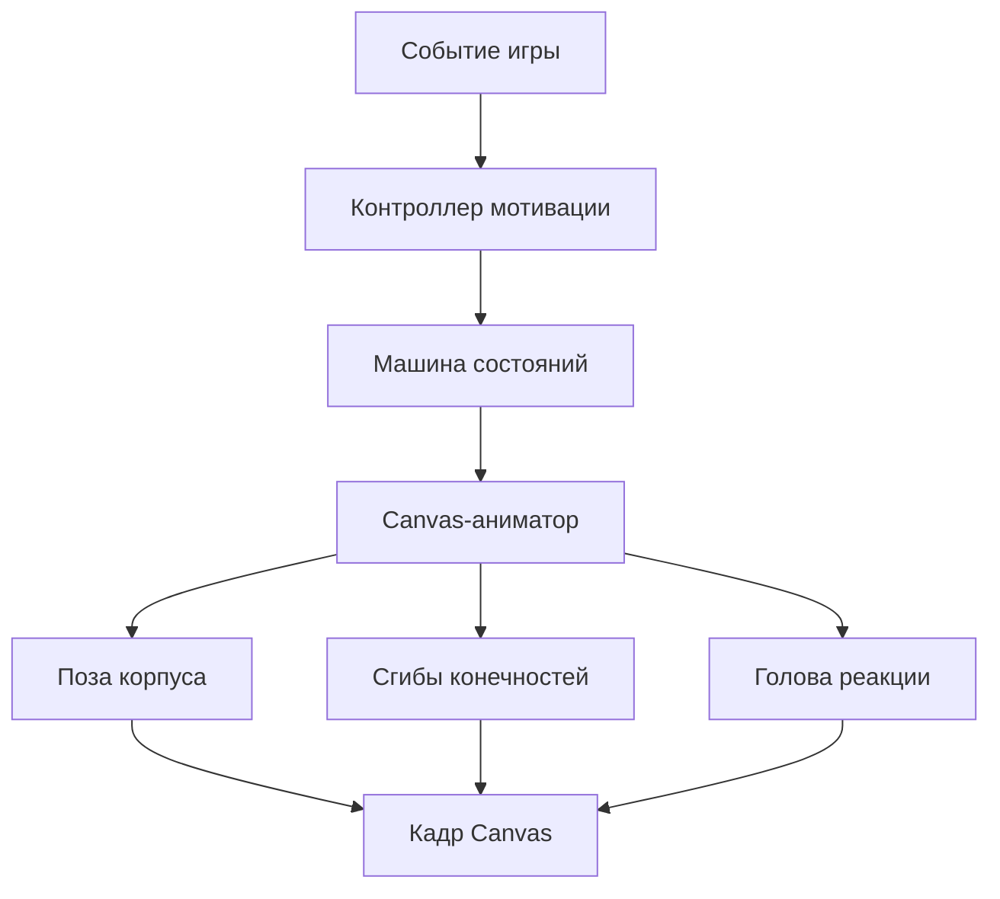

# Реализация анимации Капи

## Задача

Персонаж должен сохранять качество исходной мультяшной иллюстрации и одновременно двигаться непрерывно, как видео. Поэтому текущая реализация не переключает набор готовых GIF-кадров. Она собирает Капи из растровых частей и рассчитывает позу на каждом кадре через `requestAnimationFrame`.

## Архитектура

- `dist/app.js` создаёт события по результату игры;
- `dist/kapi-motivation.js` выбирает единственную сцену по приоритету;
- `KapiStateMachine` в `dist/kapi.js` управляет состоянием, временем и продолжением;
- `CanvasKapiAnimator` рассчитывает движение и рисует части;
- `dist/styles.css` перемещает всю Canvas-оболочку при прыжке, чтобы высота оставалась заметной на экранах разного размера;
- `CssKapiAnimator` остаётся резервным вариантом, если Canvas недоступен.

## Составной риг

Риг использует отдельные изображения:

- туловище;
- головы для разных реакций;
- левое и правое плечо;
- предплечья и лапы;
- ноги и ступни;
- специальная правая лапа с уже нарисованным флажком.

Точки плеча, локтя, запястья, бедра и щиколотки заданы в координатах исходных изображений. Каждая часть рисуется относительно сустава, а повороты наследуются по кинематической цепочке. Поэтому локоть действительно сгибается, предплечье следует за плечом, а лапа — за предплечьем.

Порядок слоёв важен. При почёсывании затылка правая лапа уходит за голову, после чего голова рисуется последней и естественно перекрывает часть предплечья.

## Плавность

Каждый кадр зависит от прошедшего времени, а не от номера картинки. Основные функции:

- `pose()` — положение, масштаб и поворот всего тела;
- `limbPose()` — углы суставов и локальное движение головы;
- `drawRigPose()` — отрисовка слоёв в правильном порядке;
- `drawEffects()` — вспомогательные эффекты сцены;
- `render()` — очистка Canvas и сборка итогового кадра.

При смене состояния предыдущая и новая позы смешиваются в течение 180 мс. Интерполяция используется и в составных финалах, поэтому Капи не перескакивает между позами.

Canvas масштабируется с учётом размера элемента и `devicePixelRatio` до 2. Координатная сцена нормализована к квадрату 700×700, поэтому пропорции рига одинаковы в игре, баннере и тестовой панели.

## Сцены

| Состояние | Длительность | Движение |
|---|---:|---|
| `idle` | цикл | дыхание, лёгкое покачивание |
| `idleBlink` | 340 мс | моргание и микросжатие |
| `idleHeadMove` | 1200 мс | небольшое движение головы |
| `idleLookLeft/Right` | 1400 мс | взгляд и смещение головы |
| `hey` | 3400 мс | приветственный взмах |
| `correct:nod` | 760 мс | кивок |
| `correct:hop` | 1050 мс | подготовка, полёт, приземление |
| `correct:cheer` | 1200 мс | обе лапы вверх |
| `wrong` | 1500 мс | рука за головой, три движения почёсывания, возврат |
| `errorRecovered` | 1050 мс | облегчённый хлопок у груди |
| `errorMastered` | 1300 мс | уверенная поднятая лапа |
| `flag` | 1600 мс | взмах лапой с флажком |
| `horn` | 2100 мс | ритмичный праздничный отскок |
| `dance` | 2400 мс | перенос веса, лапы и ноги в противофазе |
| `levelUp` | 1500 мс | победная поза, затем танец |
| `completion` | зависит от серии | вступление, затем финальный цикл |
| `perfectTraining` | 2400 мс | усиленное вступление и особый финал |

## Прыжок

Прыжок разделён на три фазы:

1. подготовка — тело приседает и расширяется;
2. полёт — вся оболочка Canvas поднимается на фиксированную видимую высоту, лапы и ноги раскрываются;
3. приземление — короткое сжатие и возврат.

Внутреннее изменение формы рассчитывает Canvas, а вертикальное перемещение выполняет CSS по атрибутам состояния и варианта. Отдельная тень остаётся на земле, меняя размер и прозрачность. Это делает прыжок читаемым даже в маленьком блоке упражнения.

## Ошибка: почёсывание затылка

В сцене `wrong` правая рука проходит четыре логических участка: подъём, удержание за головой, три колебания почёсывания и опускание. Амплитуда колебаний плавно появляется и исчезает. Голова слегка наклоняется, но не меняет образ в середине сцены.

## Головы и предметы

Для событий используются целевые головы `head-nod`, `head-hop`, `head-cheer`, `head-wrong`, `head-recovered`, `head-mastered`, `head-flag`, `head-horn-v2`, `head-dance`, `head-level`, `head-complete` и `head-perfect`.

Предметы не рисуются поверх произвольной позы. Дудочка уже находится во рту на голове праздничной сцены, а флажок уже соединён с лапой. Это сохраняет правильное перекрытие, форму силуэта и целостный стиль исходного эскиза.

При переходе `levelUp → dance` и в финальных сценах действует `continuationHead`: выбранная голова сохраняется до конца связанной последовательности.

## Машина состояний

Каждое состояние имеет приоритет, длительность, флаг цикла и необязательное следующее состояние. Более слабая реакция не прерывает более важную. После одноразовой сцены машина либо запускает заданное продолжение, либо возвращает персонажа в спокойное состояние.

Приостановленные поверхности не продолжают расходовать кадры. `ResizeObserver` обновляет буфер только при изменении размера.

## Снижение движения и отказоустойчивость

Если включён `prefers-reduced-motion`, функции позы возвращают спокойную основу и только минимальную статичную выразительность события. Пользователь не теряет обратную связь, но избегает циклического движения.

Если отдельная голова ещё не загрузилась, аниматор временно использует базовую. Если Canvas недоступен, резервный CSS-аниматор показывает целые иллюстрации состояний. Ошибка загрузки анимационного ассета не блокирует решение примеров.

## Добавление новой реакции

1. Добавить событие, приоритет, сцену и звук в `kapi-motivation.js`.
2. Добавить состояние и длительность в `STATE_CONFIG`.
3. Подготовить голову или цельную часть тела в едином масштабе рига.
4. Зарегистрировать файл в `RIG_PARTS` и сопоставить его в `headAsset()`.
5. Описать движение в `pose()` и `limbPose()`.
6. При необходимости добавить эффекты и звук.
7. Добавить кнопку в тестовый режим и автоматическую проверку.
8. Проверить начало, середину и конец сцены на игровом, домашнем и итоговом экранах.

Новая сцена не должна менять голову или костюм в середине одного смыслового действия, если это не является намеренной частью сюжета.
