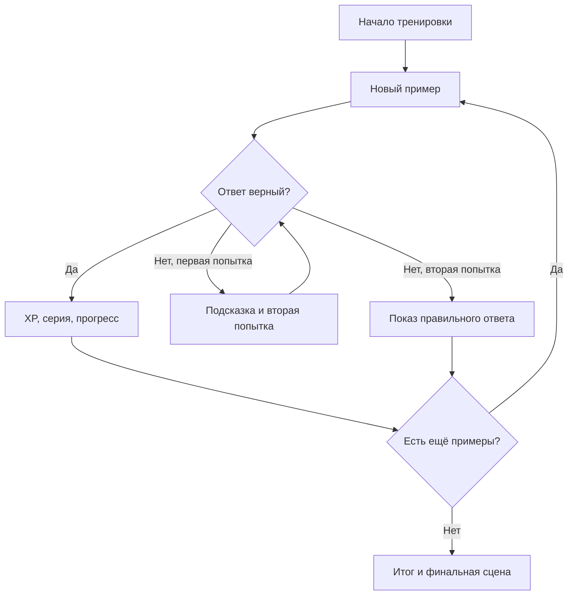

# Логика игры

## Цель игрового цикла

Одна тренировка состоит из 10, 20 или 30 примеров. На каждом шаге игра:

1. выбирает новый пример или упражнение из очереди ошибок;
2. показывает четыре варианта ответа либо поле ввода;
3. оценивает первую попытку, время решения и серию;
4. даёт вторую попытку с подсказкой при ошибке;
5. сохраняет результат и при необходимости меняет сложность;
6. запускает одну наиболее значимую реакцию Капи.

## Режимы

### Автоматический

Игра использует текущий этап профиля и сама выбирает допустимые операции. На адаптацию влияют только первые попытки в новых примерах; повторения ошибок и вторые попытки не искажают оценку уровня.

- последние 20 первых попыток хранятся в статистике этапа;
- для перехода вперёд нужны минимум 10 результатов, точность не ниже 90% и отсутствие неотработанных ошибок текущего этапа;
- если в последних 5 результатах больше 20% ошибок, уровень снижается на один этап;
- этап ограничивается выбранным диапазоном чисел.

### Ручной

Взрослый или ребёнок выбирает этап, диапазон и операции. Игра чаще предлагает операции с более высокой долей ошибок. Автоматическое повышение и понижение этапа отключено, но личный темп, XP, история и очередь ошибок продолжают работать.

Диапазоны ограничивают максимальный этап:

| Диапазон | Максимальный этап |
|---|---:|
| до 10 | 8 |
| до 20 | 14 |
| до 100 | 24 |
| больше 100 | 41 |

## Учебная программа

Версия программы — 2. Она содержит 41 последовательный этап.

| Этапы | Содержание |
|---|---|
| 1 | количество предметов от 0 до 5 |
| 2–5 | сложение: `+0`, `+1`, состав числа, суммы до 10 |
| 6–8 | вычитание и смешанные `+ / −` до 10 |
| 9–14 | числа 11–20, действия без перехода и с переходом через десяток |
| 15–18 | шаги 1/2/10 и сложение/вычитание до 100 |
| 19–20 | равные группы и умножение на 1, 2, 5, 10 |
| 21–22 | деление на равные группы и точное деление |
| 23 | последовательное изучение таблицы умножения |
| 24 | умножение и деление вместе |
| 25–28 | сложение и вычитание до 1 000 и 10 000 |
| 29 | четыре арифметических действия с большими числами |
| 30 | квадраты и кубы |
| 31–33 | смысл дроби и действия с дробями |
| 34–35 | действия с десятичными числами |
| 36–37 | отрицательные и рациональные числа |
| 38 | степени |
| 39–40 | квадратные и кубические корни |
| 41 | смешанные степени и корни |

Операции становятся доступны постепенно: сложение с этапа 2, вычитание — 6, умножение — 19, деление — 21, степени — 30, дроби — 31, десятичные — 34, отрицательные — 36, корни — 39.

### Таблица умножения и деление

Таблица умножения изучается не случайно, а фазами: умножение на 0; ряды 1, 2, 10, 5; квадраты; затем ряды 4, 3, 9, 6, 8, 7; после этого — смешанный режим.

Деление также разделено на основные делители `1, 2, 10, 5` и производные `4, 3, 9, 6, 8, 7`. Следующая фаза открывается после прохождения значений текущего ряда.

## Ошибки и закрепление

Первая ошибка добавляет пример в очередь повторения. Пример возвращается на том же этапе и только среди допустимых операций.

- после первого последующего правильного решения Капи показывает реакцию «исправлено»;
- после второго правильного решения подряд — «закреплено»;
- новая ошибка в этом примере обнуляет счётчик закрепления;
- после закрепления пример удаляется из очереди.

Повторение обычно вставляется на каждый третий шаг либо раньше, если до конца тренировки осталось мало мест.

## Очки, серии и скорость

Правильный ответ с первой попытки увеличивает серию и даёт от 1 до 3 XP:

| Условие | XP |
|---|---:|
| быстрее личного порога | 3 |
| не медленнее 1,8 личного порога | 2 |
| остальные правильные ответы | 1 |

После ошибки правильная вторая попытка даёт 1 XP, но не засчитывается как правильный ответ с первой попытки и сбрасывает серию.

Личный порог определяется по медиане первых трёх успешных решений и не может быть меньше 4 секунд. Если пользователь три раза подряд решает быстрее текущего порога, порог обновляется по медиане этих трёх результатов. Это позволяет отмечать личное улучшение, а не сравнивать ребёнка с другими.

На сериях 3, 6 и 10 запускаются специальные мотивационные события.

## Завершение и сохранение

Итог тренировки содержит число правильных ответов с первой попытки, среднее время, XP, этап, признак повышения уровня и до пяти затруднений. В браузере сохраняются последние 30 тренировок.

Профиль также хранит текущий этап, очередь ошибок, статистику операций, состояние последовательностей умножения/деления, личный темп, общий XP и серию дней.

Все данные находятся в `localStorage`; аккаунта и передачи учебной истории на сервер нет.
